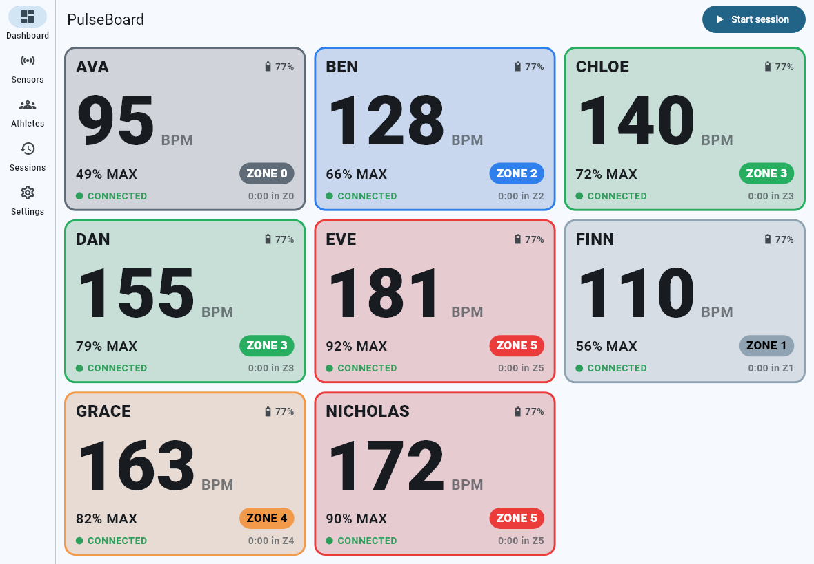
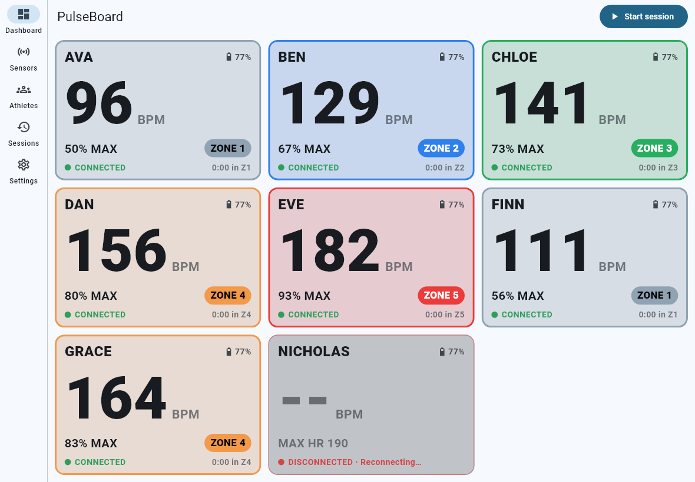
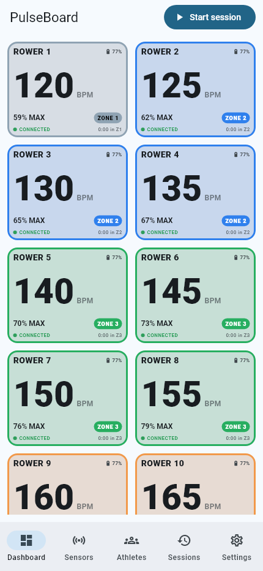
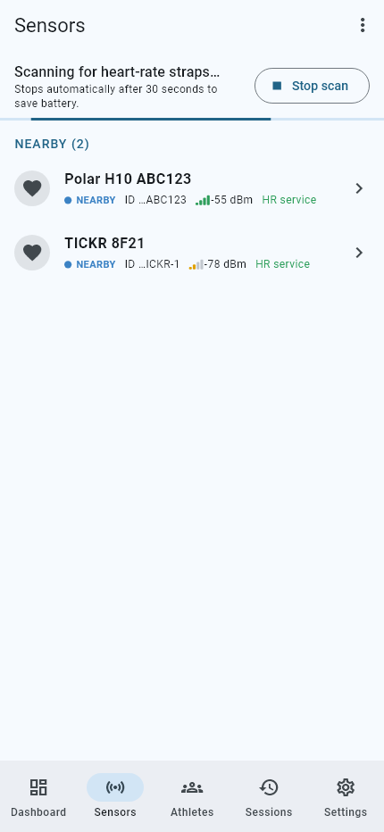
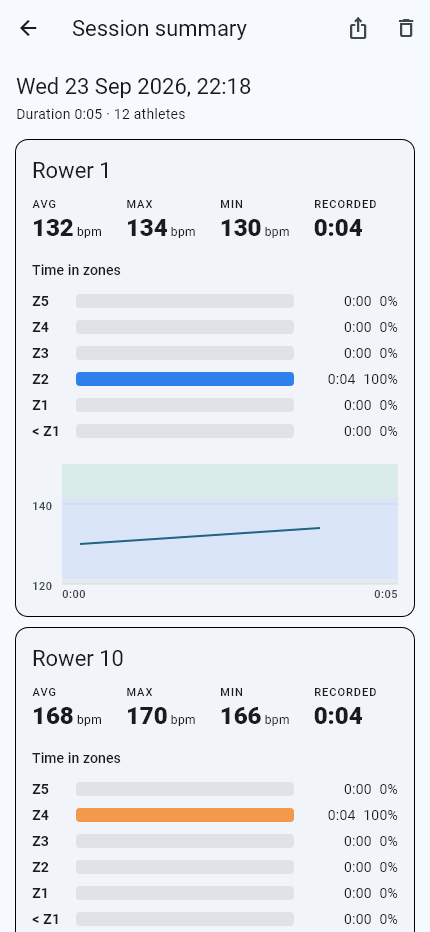

# PulseBoard

**Live heart rate for your whole team, on one screen.**

PulseBoard connects an iPhone or iPad to many standard Bluetooth LE heart-rate
chest straps at the same time and shows every athlete's live heart rate, %
of max, zone and connection status on a dashboard you can read from several
feet away. Built for rowing crews, equally at home with running, cycling,
gym and other group training.

* Works with any strap that implements the standard Bluetooth **Heart Rate
  Service (0x180D)** - Polar H10/H9, Garmin HRM series, Wahoo TICKR, COROS
  (BLE mode), Coospo, Magene and generic BLE straps. No vendor SDKs.
* Many straps connected simultaneously, each with its own reconnect logic.
* Never shows an old number as live: stale readings are greyed, lost signals
  show `--`, dropped straps show **DISCONNECTED** immediately.
* Session recording, per-athlete summary (avg/max/min, time in zones,
  dropouts, HR chart) and CSV export via the iOS share sheet.
* **Local-first:** no account, no server, no cloud, no analytics, no ads.
* Buildable **without a Mac**: GitHub Actions produces an unsigned `.ipa`
  that you install with SideStore/AltStore using a free Apple ID.

| iPad dashboard (8 athletes, auto-fit) | One strap dropped: `--` + DISCONNECTED immediately |
|---|---|
|  |  |

| Phone dashboard | Sensors | Session summary |
|---|---|---|
|  |  |  |

*Screenshots are rendered from the automated widget tests with scripted
straps. Replace them with photos from a real practice when you have them.*

---

## Contents

1. [How it works](#how-it-works)
2. [Supported sensors](#supported-sensors)
3. [Using the app at practice](#using-the-app-at-practice)
4. [SpeedCoach (experimental)](#speedcoach-experimental)
5. [Windows development setup](#windows-development-setup)
6. [Running on Windows](#running-on-windows)
7. [Building the iOS app with GitHub Actions](#building-the-ios-app-with-github-actions)
8. [Install on iPhone with SideStore](#install-on-iphone-with-sidestore)
9. [Bluetooth details and iOS limitations](#bluetooth-details-and-ios-limitations)
10. [Troubleshooting](#troubleshooting)
11. [Privacy](#privacy)
12. [Project structure and architecture](#project-structure-and-architecture)
13. [Renaming the app](#renaming-the-app)
14. [License](#license)

---

## How it works

```
Windows PC + VS Code ──git push──▶ GitHub ──Actions (macOS runner)──▶ unsigned .ipa
                                                                        │
iPhone/iPad ◀── SideStore signs & installs with your free Apple ID ◀────┘
```

Inside the app:

```
UI (screens/widgets) ─▶ Riverpod state ─▶ BluetoothManager ─▶ one HeartRateSensorConnection per strap
                                     └──▶ SessionRecorder ─▶ SQLite (on device)
```

See [docs/ARCHITECTURE.md](docs/ARCHITECTURE.md) for the full design,
reconnect strategy, data model and known risks.

## Supported sensors

Any Bluetooth LE heart-rate monitor exposing the standard Heart Rate Service
(0x180D) with the Heart Rate Measurement characteristic (0x2A37). Examples:

| Strap | Notes |
|---|---|
| Polar H10 / H9 | Excellent. H10 supports 2 simultaneous BLE connections. |
| Garmin HRM-Pro / HRM-Dual / HRM 200 / HRM 600 | BLE HR broadcast works; ANT+ is not used. |
| Wahoo TICKR / TICKR X / TICKR FIT | Works. |
| COROS Heart Rate Monitor | Works when BLE heart-rate broadcasting is available/enabled. |
| Coospo, Magene, generic "HRM" straps | Work if they follow the standard (most do). |

Also reported where available: battery level (0x180F/0x2A19), skin contact,
RR intervals (recorded and exported for later HRV analysis).

Tip: most straps only wake up when the electrodes are wet and touching skin.

## Using the app at practice

1. Open PulseBoard. The first time, read the Bluetooth explanation and allow
   Bluetooth when iOS asks.
2. **Sensors** tab → **Scan**. Nearby straps appear under *Nearby* with
   signal strength and a "HR service" badge.
3. Tap a strap → **Assign athlete** → pick an athlete or **New athlete**
   (name, optional age and/or tested max HR).
4. Repeat for everyone. Assigned straps connect automatically and are
   remembered - next practice they reconnect by themselves, no scan needed.
5. **Dashboard** shows every athlete: BPM, % max, zone (number + colour),
   status, battery, time in current zone. On iPad the grid auto-fits all
   athletes on one screen.
6. **Start session** to record. The screen stays awake while recording.
7. **Stop** → the session summary opens. Tap the share icon to export CSV
   (AirDrop, Files, Mail, Google Drive app, ...).

Card states:

| Card shows | Meaning |
|---|---|
| `172 BPM` + CONNECTED | Live, fresh data |
| greyed BPM + WEAK SIGNAL | No packet for > 5 s (configurable) |
| `--` + NO SIGNAL | No packet for > 15 s (configurable) |
| `--` + DISCONNECTED · Reconnecting… | Link lost; retrying automatically |
| NO SKIN CONTACT | Strap reports no contact (wet the electrodes / tighten) |
| SET MAX HR | Athlete has no age or max HR, so % and zone can't be computed |

Default max HR estimate is `220 − age` (Tanaka and Gellish formulas are
available in Settings). A manually entered max HR always wins.
Default zones: Z1 50-60 %, Z2 60-70 %, Z3 70-80 %, Z4 80-90 %, Z5 90 %+
(editable in Settings; each recorded session keeps the zones it used).

## SpeedCoach (experimental)

PulseBoard can also receive live data from an **NK SpeedCoach** by acting as
NK LiNK Logbook's live-streaming receiver: Settings → **SpeedCoach receiver**
→ Start, then on the SpeedCoach *Live Streaming → Phone Pairing → Find New*.
Elapsed time, stroke count and a calculated stroke rate appear in a strip on
the dashboard. NK does not publish this protocol; see
[docs/SPEEDCOACH.md](docs/SPEEDCOACH.md) for what has been decoded and the
caveats.

## Windows development setup

Tested with Windows 11, VS Code and Flutter 3.47.

1. **Git** - install from <https://git-scm.com/download/win> (defaults are fine).
2. **Enable long paths** (Flutter's SDK has deep paths). In an *admin*
   PowerShell:
   ```powershell
   git config --system core.longpaths true
   ```
3. **Flutter SDK** - follow <https://docs.flutter.dev/get-started/install/windows>.
   In short: download the stable Flutter SDK zip, extract to a short path
   such as `C:\src\flutter` (not inside `Program Files`), and add
   `C:\src\flutter\bin` to your user `PATH`.
4. **Visual Studio 2022** with the *Desktop development with C++* workload
   (needed only to run the Windows desktop version of the app).
5. **VS Code** + the *Flutter* and *Dart* extensions (VS Code will offer them;
   see `.vscode/extensions.json`).
6. Check everything:
   ```powershell
   flutter doctor
   ```
   Android/Xcode warnings can be ignored.
7. Clone and fetch packages:
   ```powershell
   git clone https://github.com/<you>/pulseboard.git
   cd pulseboard
   flutter pub get
   ```

### What you can and cannot do on Windows

| On Windows you can | You cannot |
|---|---|
| Write all Dart code, run `flutter analyze` | Run the iOS simulator or build an `.ipa` locally |
| Run all unit + widget tests (`flutter test`) | Test iOS-specific Bluetooth permission prompts |
| Run the full app as a Windows desktop app with **simulated straps** | Debug the iOS app with breakpoints |
| Run it with **real straps** if your PC has Bluetooth 4.0+ (universal_ble supports Windows) | |
| Push to GitHub and let Actions build the iOS app | |

## Running on Windows

In VS Code, open the *Run and Debug* panel and choose:

* **PulseBoard - Windows (simulated straps)** - 8 fake straps with realistic
  heart rates; strap #3 "rows out of range" every 2 minutes so you can see
  reconnection and stale handling. A purple *SIMULATED DATA* banner is always
  shown. This mode only exists when built with the flag below - it can never
  appear in an IPA built by CI.
* **PulseBoard - Windows (real Bluetooth)** - uses your PC's Bluetooth.

Or from a terminal:

```powershell
flutter run -d windows --dart-define=PULSEBOARD_SIMULATOR=true
```

Tests:

```powershell
flutter test
```

Optional: render screenshots of the widget tests into a folder (uses the
real Roboto font from your Flutter SDK):

```powershell
flutter test test/widget --dart-define=SCREENSHOT_DIR=C:/temp/pulseboard_shots
```

## Building the iOS app with GitHub Actions

1. Create a repository on GitHub (public repos get free macOS minutes;
   private repos consume your monthly minutes at the macOS multiplier).
2. Push this project:
   ```powershell
   git remote add origin https://github.com/<you>/pulseboard.git
   git push -u origin main
   ```
3. Open the **Actions** tab. Two workflows exist:
   * **Tests** - analysis + tests on Linux for pull requests and non-main
     branches.
   * **Build iOS (unsigned IPA)** - runs the tests, then builds on a macOS
     runner. Triggered by pushes to `main`, `v*` tags, or manually via
     *Run workflow*.
4. When the build finishes (≈10-15 min), open the run and download the
   artifact `PulseBoard-<version>-<build>-unsigned.ipa` at the bottom of the
   page. GitHub delivers artifacts as a `.zip`; unzip it to get the `.ipa`.

**Easiest for iPhone download - releases:** tag a version and push the tag:

```powershell
git tag v1.0.0
git push origin v1.0.0
```

The workflow attaches the `.ipa` to a GitHub Release. On the iPhone, open
the release page in Safari and tap the `.ipa` to download it straight into
the Files app.

What the workflow does (see `.github/workflows/build-ios.yml`):
`flutter build ios --release --no-codesign` → copy `Runner.app` into
`Payload/` → `zip` it as `.ipa` → verify contents → upload. It fails loudly
if the app bundle is missing; it never uploads a fake IPA. No certificates or
Apple credentials are involved or stored.

## Install on iPhone with SideStore

SideStore installs and re-signs apps on the phone using your **free Apple
ID**. Current official guide: <https://docs.sidestore.io>. Summary for Windows:

**One-time SideStore setup**

1. On the PC install **iTunes** (Microsoft Store or apple.com) and
   **iloader** (from the SideStore docs).
2. Connect the iPhone by USB, open iloader, sign in with your Apple ID,
   select the device and choose *Install SideStore (Stable)*.
3. On the iPhone:
   * Settings → General → **VPN & Device Management** → trust your Apple ID's
     developer app.
   * iOS 16+: Settings → Privacy & Security → **Developer Mode** → on
     (restart when asked).
   * Install **LocalDevVPN** from the App Store and connect it.
   * Open SideStore, sign in with the same Apple ID, go to *My Apps* and tap
     the **7 DAYS** counter once to finish setup.

**Install PulseBoard**

1. Get the `.ipa` onto the phone: download it from the GitHub Release in
   Safari, or AirDrop / OneDrive / iCloud Drive it into the Files app.
2. Connect **LocalDevVPN**.
3. SideStore → *My Apps* → **+** → pick the `.ipa`. SideStore signs and
   installs it.
4. Open PulseBoard and allow Bluetooth.

**Every 7 days (free Apple ID)**

Apps signed with a free Apple ID expire after 7 days. Before that, connect
LocalDevVPN, open SideStore → *My Apps* and tap the day counter next to
PulseBoard (and SideStore itself) to refresh. SideStore can also try to
refresh in the background. Your data is kept when refreshing or installing a
newer PulseBoard build on top.

Limits of free Apple IDs: at most **3 sideloaded apps** active at once and
**10 App IDs per 7 days**.

**AltStore** works the same way (AltServer on Windows instead of iloader).

**Updating:** install the newer `.ipa` the same way; the build number
increases with every CI run, so iOS updates in place and keeps your data.
⚠️ Deleting the app deletes all its data - export sessions first.

## Bluetooth details and iOS limitations

* **Foreground operation.** For reliability PulseBoard is designed to stay
  on screen during practice; it does not use iOS background Bluetooth
  modes. If the phone locks or you switch apps, iOS suspends it and data
  pauses. When you come back, stale indicators show the truth and quiet links
  are recycled automatically. Keep "Keep screen awake" on (default: during
  sessions). See ARCHITECTURE.md § Background operation to enable background
  mode if you really need it.
* **How many straps?** No limit is coded. iOS typically handles 10-20
  simultaneous BLE heart-rate connections well; beyond that, radio contention
  grows. Test with your real squad before race day.
* **Sensor ids** on iOS are generated per phone. The same strap has a
  different id on another iPhone, so assignments are per device. Rarely a
  strap gets a new id (Bluetooth reset, some straps after battery change) -
  it then shows as a new sensor; just reassign it.
* **One strap, many devices:** straps allow only 1-3 connections. If a watch
  or another phone holds the connection, PulseBoard may not be able to
  connect ("may be connected to another device").
* **Reconnection:** dropped straps are retried at 1, 2, 4, 8, 16, then every
  30 s (with jitter). On iOS each retry is a low-power pending connection,
  not a scan.

## Troubleshooting

| Problem | Try |
|---|---|
| No straps found when scanning | Wet electrodes and wear the strap; it sleeps otherwise. Make sure no watch/phone app is connected to it. Toggle *Show all Bluetooth devices* (⋮ menu). |
| "Bluetooth permission denied" banner | iPhone Settings → PulseBoard → enable Bluetooth (the banner has a *Settings* button). |
| Strap shows *Unnamed sensor* | Normal for some straps until connected. Assign it anyway. |
| Keeps reconnecting | Check battery; move the phone closer / higher; another device may be grabbing the strap. |
| SENSOR ERROR "does not provide the Heart Rate Service" | The device is not a standard HR strap (or HR broadcasting is off on a watch). |
| Values freeze / go grey | That's the stale protection working - the strap stopped sending. Check contact and range. |
| Something odd happened | Settings → **Diagnostics log** → copy the log. It contains Bluetooth events and sensor ids, no names or HR data. |
| App won't open after a week | Free-account signature expired; refresh in SideStore. |
| CI: `flutter build ios` fails | Open the failed step log. Most issues are version bumps: update `FLUTTER_VERSION` in both workflow files, run `flutter pub upgrade`, re-run. |

## Privacy

PulseBoard is local-first by design:

* No account, login, server, cloud sync, analytics, tracking SDK or ads.
* Athlete names, assignments, settings and every recorded heart-rate sample
  are stored only in the app's private SQLite database on the device.
* Heart-rate data leaves the device **only** when you export a CSV and choose
  a destination in the share sheet.
* The only permission requested is Bluetooth (no location).
* Deleting the app deletes all its data.

PulseBoard is a training tool, not a medical device.

## Project structure and architecture

```
lib/
  app/         app widget, theme, app_info (name/branding)
  bluetooth/   BLE interface + universal_ble implementation, simulator,
               HR parser, per-strap connection state machine, manager
  models/      immutable data models
  providers/   Riverpod state + side-effect wiring
  screens/     dashboard, sensors, athletes, sessions, settings
  session/     recorder, statistics, CSV export
  storage/     SQLite schema + repositories
  utils/       logging, formatting, dashboard grid layout
  widgets/     shared UI pieces
test/          parser, zones, stats, repositories, recorder/CSV,
               BLE state machine & manager (with a fake adapter), widget flows
.github/workflows/  test.yml, build-ios.yml
docs/ARCHITECTURE.md
```

## Renaming the app

1. `lib/app/app_info.dart` → `AppInfo.name` (and prefixes).
2. `ios/Runner/Info.plist` → `CFBundleDisplayName`, `CFBundleName` and the
   Bluetooth usage text.
3. Optional: bundle id `io.github.pulseboard.app` in
   `ios/Runner.xcodeproj/project.pbxproj`, and the IPA name in
   `.github/workflows/build-ios.yml`.

The Dart package name (`pulseboard`) can stay as is.

## License

MIT - see [LICENSE](LICENSE). Third-party packages keep their own licenses
(viewable in the app under Settings → Privacy & about → Open-source
licences). Contributions welcome - see [CONTRIBUTING.md](CONTRIBUTING.md).
